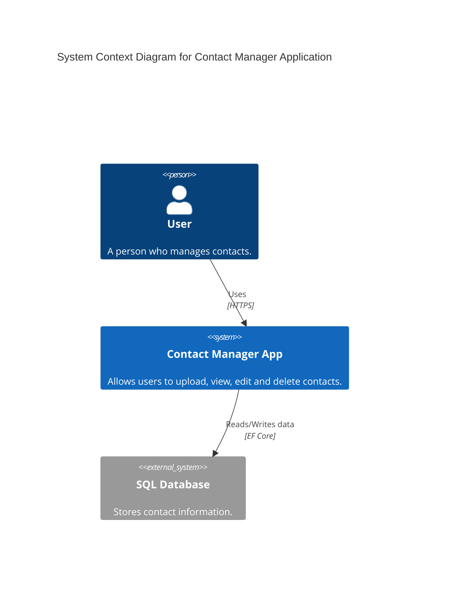

# Contact Manager Application

This is a MegaCosmo-level implementation of a Contact Manager application using ASP.NET Core MVC, Entity Framework Core, and modern best practices (SOLID, Clean Architecture).

## Features

- **CSV Upload**: Batch upload contacts from a CSV file.
- **Data Persistence**: Stores data in a SQL database (SQLite used for easy local setup).
- **Client-side Interactivity**:
  - Filtering and sorting using DataTables.
  - Inline editing of contact records.
  - Deletion of records.
- **Validation**: Server-side validation using FluentValidation and client-side validation support.
- **Architecture**: Separated into Core, Infrastructure, and Web layers.

## Tech Stack

- **Backend**: .NET 8, ASP.NET Core MVC, EF Core, CsvHelper, FluentValidation.
- **Frontend**: Bootstrap 5, jQuery, DataTables.
- **Database**: SQLite (Default), MS SQL Server (Docker support included).
- **DevOps**: Docker, Docker Compose (with MS SQL Server, Redis, Nginx), GitHub Actions.
- **Testing**: Playwright for E2E testing.

## Documentation

Comprehensive documentation is available in the [docs/](docs/) folder:
- **[C4 Architecture Diagrams](docs/C4_Documentation.md)**: Context, Container, Component, and Deployment diagrams.
- **[Detailed Technical Design](docs/Detailed_Design.md)**: Component descriptions, data flows (Sequence diagrams), and database schema.

## Infrastructure & CI/CD

All infrastructure-related files are located in the **[CI-CD/](CI-CD/)** folder:
- **[Dockerfile](CI-CD/Dockerfile)**: Multi-stage build for production-ready images.
- **[Docker Compose](CI-CD/docker-compose.yml)**: Local environment orchestration.
- **[GitHub Actions](CI-CD/dotnet.yml)**: Automated Build, Test, and Package pipeline.
- **[GitHub Push Script](CI-CD/github_push.sh)**: Safe push script with pre-flight checks.

## Project File Structure

```
.
├── CI-CD/
│   ├── Dockerfile
│   ├── docker-compose.yml
│   ├── DOCKER_MSSQL_GUIDE.md
│   ├── generate-ssl.sh
│   ├── nginx.conf
│   ├── .env.example
│   ├── dotnet.yml
│   └── github_push.sh
├── ContactManager.Core/
│   ├── Interfaces/
│   │   └── IContactService.cs
│   ├── Models/
│   │   └── Contact.cs
│   └── Validators/
│       └── ContactValidator.cs
├── ContactManager.Infrastructure/
│   ├── Data/
│   │   └── ApplicationDbContext.cs
│   ├── Migrations/
│   │   ├── 20260212205511_InitialCreate.cs
│   │   └── 20260212205511_InitialCreate.Designer.cs
│   └── Services/
│       ├── ContactService.cs
│       └── CsvService.cs
├── ContactManager.Web/
│   ├── Controllers/
│   │   └── ContactsController.cs
│   ├── Views/
│   │   ├── Contacts/
│   │   │   └── Index.cshtml
│   │   ├── Home/
│   │   │   ├── Index.cshtml
│   │   │   └── Privacy.cshtml
│   │   ├── Shared/
│   │   │   ├── _Layout.cshtml
│   │   │   ├── _ValidationScriptsPartial.cshtml
│   │   │   └── Error.cshtml
│   │   ├── _ViewImports.cshtml
│   │   └── _ViewStart.cshtml
│   ├── appsettings.json
│   └── Program.cs
├── ContactManager.Tests.E2E/
│   └── ContactTests.cs
├── docs/
│   ├── C4_Documentation.md
│   └── Detailed_Design.md
├── sample_contacts.csv
├── ContactManager.sln
├── README.md
└── .gitignore
```

**File Descriptions**
- **CI-CD/Dockerfile**: Multi-stage Docker build for the ASP.NET Core app.
- **CI-CD/docker-compose.yml**: Local orchestration for running the web app in a container.
- **CI-CD/dotnet.yml**: GitHub Actions workflow (build, test, Docker build).
- **CI-CD/github_push.sh**: безопасный скрипт для пуша с проверками.
- **ContactManager.Core/Interfaces/IContactService.cs**: Contract for business operations over contacts.
- **ContactManager.Core/Models/Contact.cs**: Domain entity and CSV DTO record.
- **ContactManager.Core/Validators/ContactValidator.cs**: FluentValidation rules for server-side validation.
- **ContactManager.Infrastructure/Data/ApplicationDbContext.cs**: EF Core DbContext configuration.
- **ContactManager.Infrastructure/Migrations/**: EF Core migration snapshots and schema history.
- **ContactManager.Infrastructure/Services/ContactService.cs**: CRUD service for contacts.
- **ContactManager.Infrastructure/Services/CsvService.cs**: CSV parsing and mapping.
- **ContactManager.Web/Controllers/ContactsController.cs**: MVC controller for upload/edit/delete.
- **ContactManager.Web/Views/**: Razor UI for listing and editing contacts.
- **ContactManager.Web/appsettings.json**: Environment configuration and connection strings.
- **ContactManager.Web/Program.cs**: Application startup and DI configuration.
- **ContactManager.Tests.E2E/ContactTests.cs**: End-to-end tests using Playwright.
- **docs/C4_Documentation.md**: C4 diagrams (Context, Container, Component, Deployment).
- **docs/Detailed_Design.md**: Detailed technical design, flows, and schema.
- **sample_contacts.csv**: Sample data for CSV upload.
- **ContactManager.sln**: Solution file.
- **README.md**: Project documentation (EN/RU).
- **.gitignore**: Git ignore rules.

## Getting Started

### Prerequisites

- .NET 8 SDK
- Docker (optional, for containerized run)

### Local Run (Standard)

1. Clone the repository.
2. Build the solution: `dotnet build`.
3. Run the application: `dotnet run --project ContactManager.Web`.
4. Open `http://localhost:5021`.

### Local Run (Docker)

#### Quick Start with SQLite (Default)
1. Navigate to the `CI-CD` directory: `cd CI-CD`.
2. Start the containers: `docker-compose up --build`.
3. Open `http://localhost:8080`.

#### Run with MS SQL Server
1. Navigate to the `CI-CD` directory: `cd CI-CD`.
2. Start with SQL Server: `docker-compose up -d sqlserver web`.
3. Open `http://localhost:8080`.

#### Advanced Docker Options
- **With Management Studio**: `docker-compose --profile management up -d`
- **With Redis Cache**: `docker-compose --profile cache up -d`
- **Production with Nginx**: `docker-compose --profile production up -d`

See [CI-CD/DOCKER_MSSQL_GUIDE.md](CI-CD/DOCKER_MSSQL_GUIDE.md) for detailed MS SQL Server configuration.

### Run Tests

1. Restore and build: `dotnet build`.
2. Run E2E tests: `dotnet test ContactManager.Tests.E2E`.

---

# Менеджер Контактов (RU)

Это реализация приложения для управления контактами уровня Senior, использующая ASP.NET Core MVC, Entity Framework Core и лучшие практики программирования.

## Особенности

- **Загрузка CSV**: Массовая загрузка контактов из CSV файла.
- **Сохранение данных**: Хранение данных в SQL базе данных (SQLite для локальной разработки).
- **Интерактивность на клиенте**:
  - Фильтрация и сортировка с использованием DataTables.
  - Редактирование записей контактов в строке.
  - Удаление записей.
- **Валидация**: Серверная валидация с использованием FluentValidation и поддержка клиентской валидации.
- **Архитектура**: Разделение на уровни Core, Infrastructure и Web.

## Технологии
- **Бэкенд**: .NET 8, ASP.NET Core MVC, EF Core, CsvHelper, FluentValidation.
- **Фронтенд**: Bootstrap 5, jQuery, DataTables.
- **База данных**: SQLite (по умолчанию), MS SQL Server (поддержка Docker).
- **DevOps**: Docker, Docker Compose (с MS SQL Server, Redis, Nginx), GitHub Actions.
- **Тестирование**: Playwright для E2E тестов.

## Документация

Полная документация доступна в папке [docs/](docs/):
- **[C4 Архитектурные диаграммы](docs/C4_Documentation.md)**: Уровни Context, Container, Component и Deployment.
- **[Детальное описание системы](docs/Detailed_Design.md)**: Описание компонентов, потоки данных (Sequence диаграммы) и схема БД.

## Инфраструктура и CI/CD

Все файлы инфраструктуры находятся в папке **[CI-CD/](CI-CD/)**:
- **Dockerfile**: Оптимизированная сборка образа.
- **Docker Compose**: Запуск всего окружения одной командой.
- **GitHub Actions**: Автоматизированный пайплайн сборки и тестирования.
- **GitHub Push Script**: Скрипт для безопасной публикации изменений.

## Структура проекта

```
.
├── CI-CD/
│   ├── Dockerfile
│   ├── docker-compose.yml
│   ├── DOCKER_MSSQL_GUIDE.md
│   ├── generate-ssl.sh
│   ├── nginx.conf
│   ├── .env.example
│   ├── dotnet.yml
│   └── github_push.sh
├── ContactManager.Core/
│   ├── Interfaces/
│   │   └── IContactService.cs
│   ├── Models/
│   │   └── Contact.cs
│   └── Validators/
│       └── ContactValidator.cs
├── ContactManager.Infrastructure/
│   ├── Data/
│   │   └── ApplicationDbContext.cs
│   ├── Migrations/
│   │   ├── 20260212205511_InitialCreate.cs
│   │   └── 20260212205511_InitialCreate.Designer.cs
│   └── Services/
│       ├── ContactService.cs
│       └── CsvService.cs
├── ContactManager.Web/
│   ├── Controllers/
│   │   └── ContactsController.cs
│   ├── Views/
│   │   ├── Contacts/
│   │   │   └── Index.cshtml
│   │   ├── Home/
│   │   │   ├── Index.cshtml
│   │   │   └── Privacy.cshtml
│   │   ├── Shared/
│   │   │   ├── _Layout.cshtml
│   │   │   ├── _ValidationScriptsPartial.cshtml
│   │   │   └── Error.cshtml
│   │   ├── _ViewImports.cshtml
│   │   └── _ViewStart.cshtml
│   ├── appsettings.json
│   └── Program.cs
├── ContactManager.Tests.E2E/
│   └── ContactTests.cs
├── docs/
│   ├── C4_Documentation.md
│   └── Detailed_Design.md
├── sample_contacts.csv
├── ContactManager.sln
├── README.md
└── .gitignore
```

**Описание файлов**
- **CI-CD/Dockerfile**: Мультистадийная сборка Docker-образа с поддержкой MS SQL Server и SQLite.
- **CI-CD/docker-compose.yml**: Полная оркестрация с MS SQL Server, Redis, Nginx и профилями.
- **CI-CD/DOCKER_MSSQL_GUIDE.md**: Руководство по настройке и использованию MS SQL Server в Docker.
- **CI-CD/generate-ssl.sh**: Скрипт генерации SSL сертификатов для тестирования.
- **CI-CD/nginx.conf**: Конфигурация Nginx reverse proxy с SSL и безопасностью.
- **CI-CD/.env.example**: Пример файла окружения с настройками баз данных.
- **ContactManager.Core/Interfaces/IContactService.cs**: Контракт бизнес-логики по контактам.
- **ContactManager.Core/Models/Contact.cs**: Доменная сущность и CSV DTO record.
- **ContactManager.Core/Validators/ContactValidator.cs**: Серверные правила валидации.
- **ContactManager.Infrastructure/Data/ApplicationDbContext.cs**: EF Core контекст.
- **ContactManager.Infrastructure/Migrations/**: История миграций EF Core.
- **ContactManager.Infrastructure/Services/ContactService.cs**: Сервис CRUD операций.
- **ContactManager.Infrastructure/Services/CsvService.cs**: Парсинг CSV и маппинг.
- **ContactManager.Web/Controllers/ContactsController.cs**: MVC контроллер.
- **ContactManager.Web/Views/**: Razor UI представления.
- **ContactManager.Web/appsettings.json**: Настройки окружения и строка подключения.
- **ContactManager.Web/Program.cs**: Конфигурация DI и запуск приложения.
- **ContactManager.Tests.E2E/ContactTests.cs**: E2E тесты на Playwright.
- **docs/C4_Documentation.md**: C4 диаграммы уровней 1–4.
- **docs/Detailed_Design.md**: Детальный дизайн, потоки данных и схема БД.
- **sample_contacts.csv**: Пример CSV для загрузки.
- **ContactManager.sln**: Файл решения.
- **README.md**: Документация проекта.
- **.gitignore**: Правила игнорирования файлов в git.

## Инструкция по запуску

### Обычный запуск
1. Соберите решение: `dotnet build`.
2. Запустите: `dotnet run --project ContactManager.Web`.
3. Откройте `http://localhost:5021`.

### Запуск через Docker
#### Быстрый старт с SQLite (по умолчанию)
1. Перейдите в папку: `cd CI-CD`.
2. Запустите: `docker-compose up --build`.
3. Откройте `http://localhost:8080`.

#### Запуск с MS SQL Server
1. Перейдите в папку: `cd CI-CD`.
2. Запустите с SQL Server: `docker-compose up -d sqlserver web`.
3. Откройте `http://localhost:8080`.

#### Расширенные опции Docker
- **С Management Studio**: `docker-compose --profile management up -d`
- **С Redis Cache**: `docker-compose --profile cache up -d`
- **Продакшен с Nginx**: `docker-compose --profile production up -d`

См. [CI-CD/DOCKER_MSSQL_GUIDE.md](CI-CD/DOCKER_MSSQL_GUIDE.md) для детальной конфигурации MS SQL Server.

### Запуск тестов

1. Соберите решение: `dotnet build`.
2. Запустите E2E тесты: `dotnet test ContactManager.Tests.E2E`.

---

## C4 Documentation

### Level 1: System Context Diagram



### Level 2: Container Diagram

```mermaid
C4Container
    title Container Diagram for Contact Manager Application
    
    Person(user, "User", "A person who manages contacts.")
    
    System_Boundary(c1, "Contact Manager App") {
        Container(web_app, "Web Application", "ASP.NET Core MVC", "Provides UI and handles requests.")
        Container(api, "Business Logic & Data Access", ".NET Core Libraries", "Processes CSVs and manages DB operations.")
    }
    
    ContainerDb(db, "Database", "SQLite/SQL Server", "Stores contacts.")
    
    Rel(user, web_app, "Uses", "HTTPS")
    Rel(web_app, api, "Calls", "In-process")
    Rel(api, db, "Reads/Writes", "SQL/EF Core")

### Level 3: Component Diagram

```mermaid
C4Component
    title Component Diagram for Contact Manager Application
    
    Container_Boundary(web_app_boundary, "Web Application") {
        Component(contacts_controller, "ContactsController", "MVC Controller", "Handles HTTP requests for contacts.")
        Component(contact_service, "ContactService", "Service", "Orchestrates business logic and DB operations.")
        Component(csv_service, "CsvService", "Service", "Parses CSV files.")
        Component(validator, "ContactValidator", "FluentValidation", "Validates contact data.")
    }
    
    ContainerDb(db, "Database", "SQLite/SQL Server", "Stores contacts.")
    
    Rel(contacts_controller, contact_service, "Uses")
    Rel(contacts_controller, csv_service, "Uses")
    Rel(contacts_controller, validator, "Uses")
    Rel(contact_service, db, "Reads/Writes", "EF Core")
```
```
