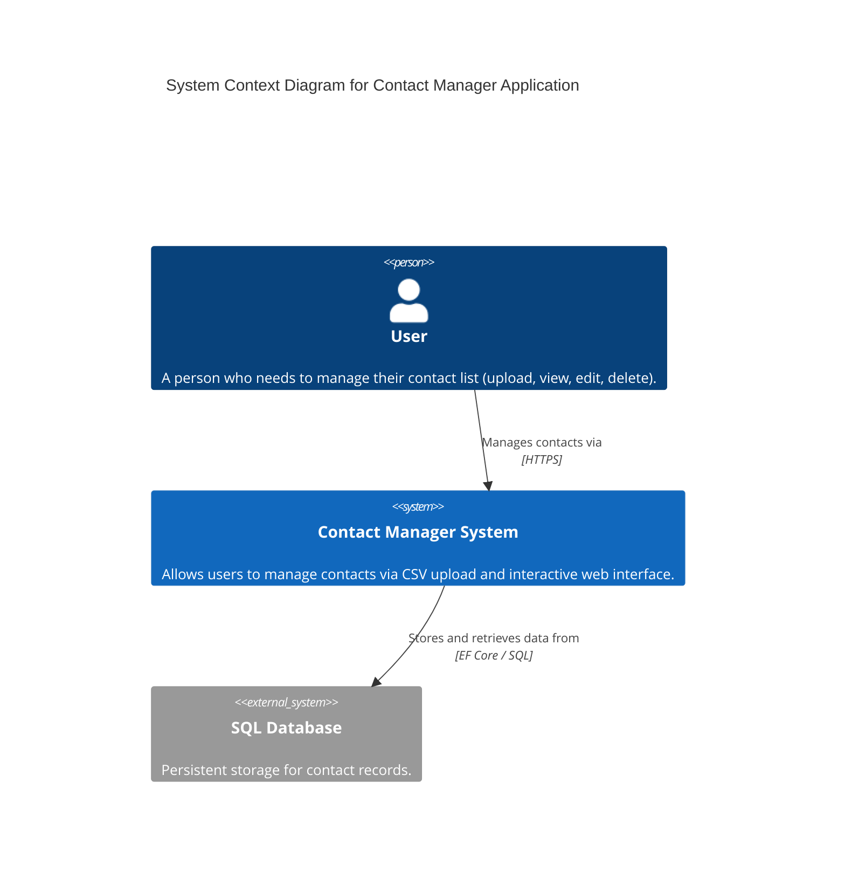
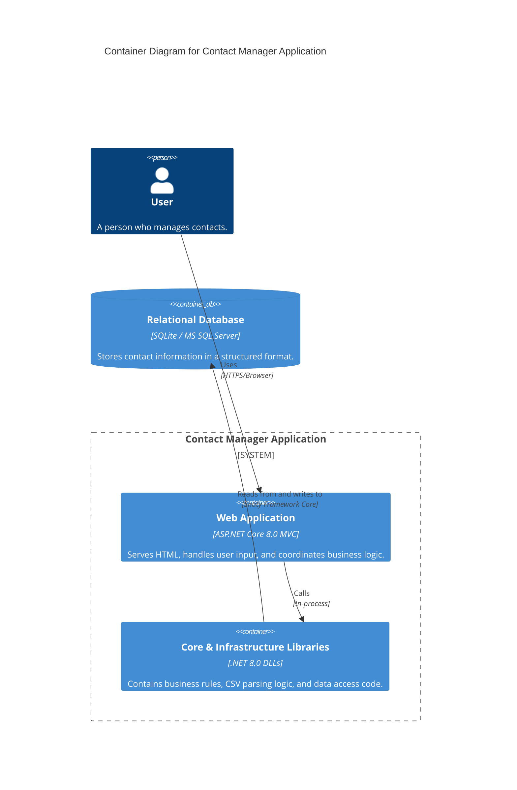
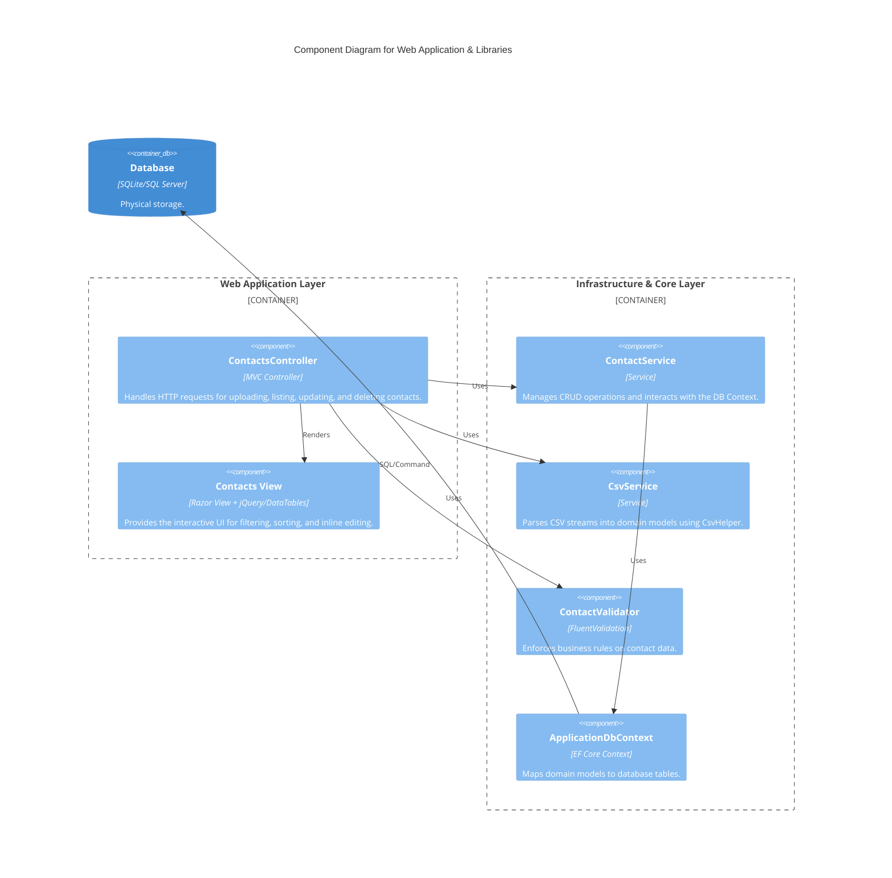

# C4 Model Documentation

This document provides a comprehensive overview of the Contact Manager Application architecture using the C4 model.

## 1. System Context Diagram (Level 1)
The highest level of abstraction, showing the application as a black box and its interactions with users and external systems.



## 2. Container Diagram (Level 2)
Shows the high-level technical building blocks of the system.



## 3. Component Diagram (Level 3)
Decomposes the containers into their constituent components.



## 4. Deployment Diagram (Level 4)
Shows how the system is mapped to infrastructure.

```mermaid
deploymentDiagram
    title Deployment Diagram - Dockerized Environment
    
    Node(client_comp, "Client Computer", "Web Browser") {
        Container(browser, "Chrome/Firefox/Edge", "User Interface")
    }
    
    Node(docker_host, "Docker Host", "Linux/Windows with Docker") {
        Node(app_container, "App Container", "Docker (Alpine .NET Runtime)") {
            Container(app_exec, "ContactManager.Web.dll", "Kestrel Server")
        }
        Node(db_node, "Database Node", "SQLite File or SQL Container") {
            ContainerDb(physical_db, "ContactManager.db", "Data Storage")
        }
    }
    
    Rel(browser, app_exec, "HTTPS (Port 80/443)", "TCP/IP")
    Rel(app_exec, physical_db, "File System / Network", "EF Core")

---

**For a deeper dive into the code-level implementation, data flows, and component interactions, please refer to the [Detailed Design Documentation](Detailed_Design.md).**
```
