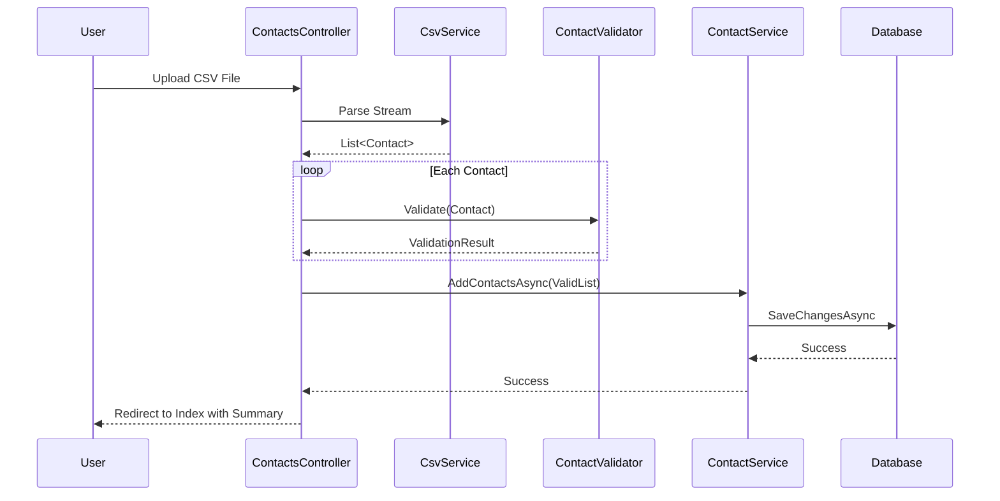
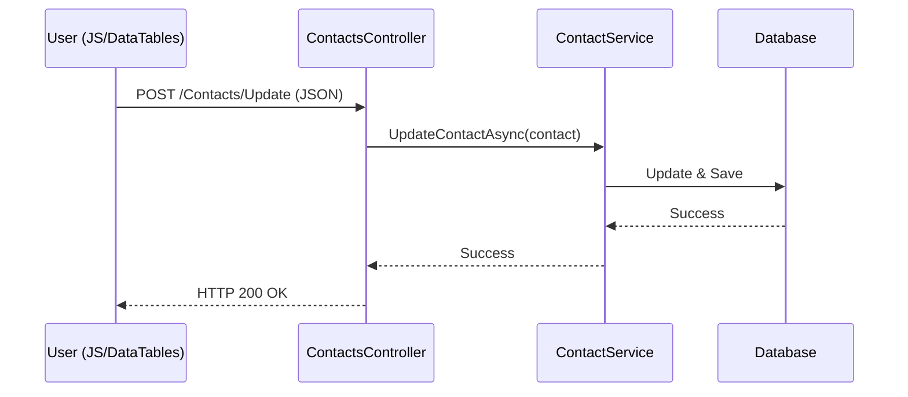

# Detailed Software Design Documentation (C4 Model - Level 3 & 4 Depth)

This document provides a deep dive into the implementation details, architectural patterns, and code-level components of the Contact Manager Application.

## 1. Architectural Overview
The system follows the **Clean Architecture** principles, ensuring separation of concerns and independence from frameworks.

- **Core Layer**: Domain models, interfaces, and business logic.
- **Infrastructure Layer**: Data access (EF Core), external services (CSV parsing), and service implementations.
- **Web Layer**: UI (Razor Pages), Controllers, and Client-side logic (JavaScript/DataTables).

---

## 2. Component Deep Dive (Level 3 - Detailed)

### 2.1 Web Component: `ContactsController`
The entry point for user interactions. It orchestrates the flow of data between the UI and the service layer.

- **Responsibilities**:
    - Mapping HTTP requests to service calls.
    - Handling file uploads (Multipart/form-data).
    - Returning appropriate HTTP status codes (200 OK, 400 BadRequest, 500 Error).
    - Managing `TempData` for user notifications.
- **Key Methods**:
    - `Upload(IFormFile file)`: Receives CSV, delegates parsing to `CsvService`, and saves via `ContactService`.
    - `Update(Contact contact)`: Receives JSON data for inline editing.
    - `Delete(int id)`: Handles record removal.

### 2.2 Infrastructure: `CsvService`
A specialized service for high-performance CSV processing.

- **Technology**: [CsvHelper](https://joshclose.github.io/CsvHelper/)
- **Design Pattern**: Strategy/Mapping.
- **Key Features**:
    - **Class Mapping**: Uses `ContactMap` to strictly define how CSV headers map to the `Contact` model.
    - **Stream Processing**: Processes files as streams to minimize memory footprint for large files.
    - **Error Resilience**: Implements error handling during parsing to identify malformed rows without crashing the entire process.

### 2.3 Core: `ContactService`
The heart of the business logic.

- **Responsibilities**:
    - Encapsulating Database CRUD operations.
    - Abstracting `ApplicationDbContext` from the Web layer.
- **Implementation**: Uses **Repository-like** pattern to ensure the Web layer doesn't need to know about EF Core tracking or DB-specific logic.

### 2.4 Validation: `ContactValidator`
Ensures data integrity before it reaches the database.

- **Technology**: [FluentValidation](https://docs.fluentvalidation.net/)
- **Rules**:
    - `Name`: Required, max 100 characters.
    - `DateOfBirth`: Must be a valid date in the past.
    - `Phone`: Validated against E.164 international format regex.
    - `Salary`: Must be a non-negative decimal.
    - `Married`: Boolean flag.

---

## 3. Data Flow Diagrams

### 3.1 CSV Upload Flow

### 3.2 Inline Editing Flow

---

## 4. Database Schema
The system uses a single primary table managed by EF Core Code-First.

| Column | Type | Constraints | Description |
| :--- | :--- | :--- | :--- |
| `Id` | `int` | PK, Identity | Unique identifier. |
| `Name` | `nvarchar(100)` | Required | Full name of the contact. |
| `DateOfBirth` | `datetime2` | Required | Birth date. |
| `Married` | `bit` | Required | Marital status. |
| `Phone` | `nvarchar(max)` | Required | Contact phone number. |
| `Salary` | `decimal(18,2)` | Required | Annual/Monthly salary. |

### 4.1 Switching to MS SQL Server
Although the project defaults to SQLite for portable demonstration, it is designed for MS SQL Server. To switch:
1. Update the connection string in `appsettings.json`.
2. In `Program.cs`, change `options.UseSqlite(...)` to `options.UseSqlServer(...)`.
3. Re-run migrations or use `context.Database.EnsureCreated()`.

---

## 5. Deployment & Runtime (Level 4 - Technical)

### 5.1 Docker Infrastructure
The application is containerized to ensure "Run Anywhere" capability.

- **Base Image**: `mcr.microsoft.com/dotnet/aspnet:8.0-alpine` (Security-hardened, small footprint).
- **Network**: Uses bridge network for internal communication.
- **Persistence**: 
    - **SQLite**: Mounted via Docker Volume to `./data`.
    - **SQL Server**: (Optional) Connection via environment variables.

### 5.2 CI/CD Pipeline Logic
The GitHub Actions workflow [dotnet.yml](file:///e:/TestTask/Bits%20OrchestraTest%20Task/CI-CD/dotnet.yml) follows the **Build-Test-Package** pattern:
1. **Restore**: Fetches NuGet packages.
2. **Build**: Compiles the solution in Release mode.
3. **Unit/E2E Tests**: Runs all automated tests.
4. **Docker Build**: Verifies that the Dockerfile is valid and creates a deployable artifact.
